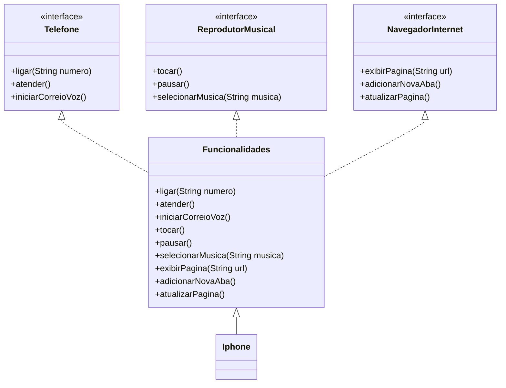

# Modelagem e Diagramação de um Componente iPhone

Desafio da trilha **Java Básico** (Digital Innovation One) sobre Programação Orientada a Objetos, com foco em modelagem UML e implementação em Java.

## Descrição

O desafio consiste em modelar, via diagrama UML, e implementar em Java o componente **iPhone**, representando-o como a união de três funcionalidades: Reprodutor Musical, Aparelho Telefônico e Navegador de Internet — inspirado na forma como o produto foi apresentado no lançamento original de 2007.

## Contexto

A modelagem foi baseada no vídeo de lançamento do iPhone (2007), em que o aparelho é descrito como três produtos em um só: um iPod, um telefone e um navegador de internet.

📺 [Lançamento iPhone 2007](https://www.youtube.com/watch?v=9ou608QQRq8) — minutos 00:15 a 00:55

## Diagrama UML



## Estrutura do projeto

```
├── Telefone.java             # Interface com os métodos de telefonia
├── ReprodutorMusical.java    # Interface com os métodos de reprodução musical
├── NavegadorInternet.java    # Interface com os métodos de navegação
├── Funcionalidades.java      # Classe que implementa as três interfaces
├── Iphone.java                # Classe principal, herda de Funcionalidades e executa a demonstração
└── README.md
```

## Tecnologias e conceitos aplicados

- Java
- Programação Orientada a Objetos (POO)
- Interfaces e implementação múltipla
- Herança
- Diagrama de classes UML (Mermaid)

## Como executar

```bash
javac Iphone.java Funcionalidades.java Telefone.java ReprodutorMusical.java NavegadorInternet.java
java Iphone
```

## Autor

- [Murilo Lopes](https://github.com/Murilo11)